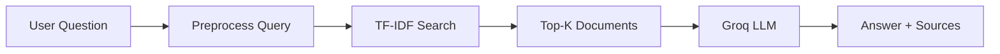

<p align="center">
  <strong>RAG Document Assistant</strong><br>
  Ask questions over your documents — retrieve with TF-IDF, answer with Groq LLM.
</p>

<p align="center">
  
  
  
  
</p>

---

## About

**RAG Document Assistant** is a portfolio project that implements a full **Retrieval-Augmented Generation** pipeline in Python.

You upload plain-text or PDF knowledge files, ask a question in natural language, and the system:

1. **Retrieves** the most relevant documents using TF-IDF and cosine similarity
2. **Generates** a grounded answer using the Groq LLM API
3. **Cites** the source files with similarity scores

Built to demonstrate skills in **Python**, **NLP retrieval**, **RAG architecture**, **REST APIs**, and **frontend integration**.

<!-- Add a screenshot after taking one: save as docs/demo.png and uncomment the line below -->
<!--  -->

---

## How it works



| Stage | Technology | What happens |
|-------|------------|--------------|
| **Ingest** | `document_loader.py` | Load `.txt` and `.pdf` files from `documents/` |
| **Preprocess** | `preprocessing.py` | Lowercase, remove punctuation, tokenize |
| **Retrieve** | `search_engine.py` | TF-IDF vectors + cosine similarity ranking |
| **Generate** | `rag.py` | Pass excerpts as context → Groq LLM |
| **Serve** | `api.py` + `static/` | REST API + chat UI |

---

## Features

- 🔍 **TF-IDF retrieval** — classic IR with scikit-learn, no GPU required
- 🤖 **RAG pipeline** — LLM answers grounded in retrieved document text
- 💬 **Chat UI** — clean interface with typing indicator and source cards
- 🔌 **REST API** — `/api/ask` for full RAG, `/search` for retrieval only
- 📄 **Source citations** — every answer shows which files were used

---

## Quick Start

**1. Clone and set up the environment**

```bash
cd smart-document-search
python -m venv .venv
source .venv/Scripts/activate   # Git Bash (Windows)
pip install -r requirements.txt
```

**2. Add your Groq API key** (free at [console.groq.com/keys](https://console.groq.com/keys))

```bash
cp .env.example .env
```

```env
LLM_PROVIDER=groq
GROQ_API_KEY=gsk_your-key-here
```

**3. Run the API**

```bash
uvicorn app.api:app --reload
```

**4. Frontend (React + TypeScript)**

Build once and let FastAPI serve the UI at **http://127.0.0.1:8000**:

```bash
cd frontend
npm install
npm run build
cd ..
uvicorn app.api:app --reload
```

For hot reload during UI work, run the API and Vite dev server in two terminals:

```bash
# Terminal 1 — API
uvicorn app.api:app --reload

# Terminal 2 — React dev server (proxies /api and /search to :8000)
cd frontend && npm install && npm run dev
```

Open **http://127.0.0.1:5173** for development, or **http://127.0.0.1:8000** after `npm run build`.

Try: *"What is RAG and how does it work?"*

---

## Run with Docker

**1. Configure environment**

```bash
cd smart-document-search
cp .env.example .env
# Edit .env and set GROQ_API_KEY
```

**2. Build and start**

**Recommended on slow connections (lite — ~2 min build, TF-IDF retrieval):**

```bash
docker compose --profile lite up --build
```

**Full hybrid retrieval (embeddings + TF-IDF — downloads CPU torch ~190 MB during build):**

```bash
docker compose --profile full build --no-cache
docker compose --profile full up
```

Open **http://127.0.0.1:8000**.

**Build notes**
- There is **no official `pytorch/pytorch:*-cpu` image** on Docker Hub — the full image installs CPU torch via pip
- The **lite** profile skips torch, sentence-transformers, and ChromaDB; the app uses **TF-IDF fallback** (same as local dev when embeddings are unavailable)
- Full build: allow **15–30 minutes** on a slow connection for the torch wheel; if `Read timed out`, rerun `docker compose build --no-cache`
- After first start, the full image may download the embedding model inside the container

**Notes**
- Full Docker uses `requirements-docker.txt`; lite uses `requirements-docker-lite.txt` (no pytest)
- `.env` is loaded via `env_file` in `docker-compose.yml` (never commit `.env`)
- ChromaDB vectors persist in the `chroma_data` Docker volume at `/app/chroma_db`
- Stop with `docker compose down` (add `-v` to remove the Chroma volume)

**Troubleshooting**
- `docker compose build` only builds the image — you must run **`docker compose up`** to start the app
- Copy `.env.example` to `.env` and set `GROQ_API_KEY` for LLM answers (without it you get extractive fallback text)
- First startup can take **2–5 minutes** while the embedding model downloads; watch progress: `docker compose logs -f`
- Check health: `curl http://127.0.0.1:8000/api/health` — `retriever_ready: false` means indexing is still running
- If port 8000 is busy, stop local uvicorn or change the port mapping in `docker-compose.yml`

--- 

## Tests

```bash
cd smart-document-search
pip install -r requirements.txt
python -m pytest -v
```

Tests cover document loading, preprocessing, chunk retrieval, and `POST /api/ask` with a mocked LLM (no real API calls).

---

## API

| Method | Endpoint | Description |
|--------|----------|-------------|
| `GET` | `/api/health` | Liveness check — retriever index ready |
| `GET` | `/api/stats` | Document count, chunk count, retrieval method |
| `POST` | `/api/ask` | Full RAG — retrieve chunks + generate answer |
| `GET` | `/search?q=...` | Retrieval only — ranked chunk list |

<details>
<summary><strong>Example: GET /api/health</strong></summary>

```json
{
  "status": "ok",
  "retriever_ready": true
}
```

</details>

<details>
<summary><strong>Example: GET /api/stats</strong></summary>

```json
{
  "document_count": 12,
  "chunk_count": 48,
  "retrieval_method": "Hybrid (Embeddings + TF-IDF)",
  "llm_provider": "Groq"
}
```

</details>

<details>
<summary><strong>Example: POST /api/ask</strong></summary>

**Request**
```json
{
  "query": "What is gradient descent?",
  "top_k": 3
}
```

**Response**
```json
{
  "query": "What is gradient descent?",
  "answer": "Gradient descent is an optimization algorithm...",
  "sources": [
    {
      "document": "machine_learning.txt",
      "chunk_id": "machine_learning.txt:1",
      "similarity_score": 0.9244
    }
  ],
  "provider": "groq"
}
```

</details>

<details>
<summary><strong>Backward compatibility: GET /search</strong></summary>

Response shape is unchanged at the top level: `query` + `top_results`. Each hit still includes `document` and `similarity_score`. Since v2 retrieval, each hit also includes `chunk_id` (additive field). Results are ranked **chunks**, not whole files.

</details>

Interactive docs: **http://127.0.0.1:8000/docs**

---

## Project Structure

```
smart-document-search/
├── app/
│   ├── config.py            # Settings from .env
│   ├── document_loader.py   # Load .txt and .pdf files
│   ├── preprocessing.py     # Text normalization
│   ├── search_engine.py     # TF-IDF + cosine similarity
│   ├── rag.py               # Retrieval + Groq generation
│   ├── api.py               # FastAPI routes
│   └── main.py              # CLI demo
├── documents/               # Knowledge base (12 sample files)
├── frontend/                # React + TypeScript chat UI (Vite)
│   ├── src/                 # App, API client, components
│   └── dist/                # Production build (served by FastAPI)
├── static/                  # Legacy vanilla UI (fallback if no dist/)
├── tests/                   # pytest suite
├── Dockerfile               # Full hybrid retrieval (CPU torch via pip)
├── Dockerfile.lite          # Fast TF-IDF-only image
├── docker-compose.yml
├── requirements-docker.txt
├── requirements-docker-lite.txt
├── .env.example
└── requirements.txt
```

<details>
<summary><strong>What each file does</strong></summary>

| File | Purpose |
|------|---------|
| `config.py` | Loads paths and Groq credentials from `.env` |
| `document_loader.py` | Reads `.txt` and `.pdf` corpus (skips `README.*`) |
| `preprocessing.py` | Cleans text before indexing |
| `search_engine.py` | Builds TF-IDF matrix, ranks by similarity |
| `rag.py` | Builds LLM context, calls Groq, returns answer + sources |
| `api.py` | HTTP endpoints; serves React `frontend/dist/` or legacy `static/` |
| `main.py` | Terminal demo without browser |
| `frontend/src/App.tsx` | Chat UI (messages, sources, suggestions) |
| `frontend/src/api.ts` | Fetch helpers for `/api/stats` and `/api/ask` |
| `static/index.html` | Legacy chat page (fallback) |

</details>

---

## Tech Stack

| Layer | Tools |
|-------|-------|
| Backend | Python, FastAPI, Uvicorn |
| Retrieval | scikit-learn (TF-IDF, cosine similarity) |
| Generation | Groq LLM (Llama 3.3) |
| Frontend | React, TypeScript, Vite |

---

## Scanned PDFs (OCR)

Text-based PDFs work out of the box. **Scanned PDFs** (image-only pages) need OCR.

| How you run | Extra install needed? |
|-------------|------------------------|
| **Docker** (`docker compose --profile lite up`) | No — Tesseract and Poppler are already in the image |
| **Local Python** (`uvicorn …`) | Yes — only if you use scanned PDFs |

**You do not need to install anything before `git push`.** Push uploads your code to GitHub only. OCR tools matter when you *run* the app locally with scanned PDFs.

### Local setup (Windows)

**1. Install system tools** (one-time):

- **Tesseract OCR** (include German language data): [UB Mannheim Windows builds](https://github.com/UB-Mannheim/tesseract/wiki)
- **Poppler** (for PDF → image): [poppler-windows releases](https://github.com/oschwartz10612/poppler-windows/releases) — add the `bin` folder to your PATH

**2. Python packages** (already in `requirements.txt`):

```bash
pip install -r requirements.txt
```

**3. Configure `.env`** for German scanned PDFs:

```env
OCR_ENABLED=true
OCR_LANG=deu
```

Use `OCR_LANG=deu+eng` for mixed German/English documents. Set `OCR_ENABLED=false` to skip OCR entirely.

After adding or changing files in `documents/`, restart the API server so the index is rebuilt.

---

## Notes

- Never commit `.env` — it contains your API key (already in `.gitignore`)
- Files named `README.txt` or `README.pdf` inside `documents/` are not indexed
- Supported formats: `.txt` (UTF-8) and `.pdf` (embedded text via pypdf, scanned pages via Tesseract OCR)
- OCR needs **Tesseract** and **Poppler** installed locally on Windows/macOS/Linux when not using Docker; Docker images include them automatically
- Disable OCR with `OCR_ENABLED=false`; set `OCR_LANG=deu` or `deu+eng` for German documents (see **Scanned PDFs (OCR)** above)
- The `openai` Python package is used as a client for the Groq-compatible API

---

## Author

**Wiem Gallaoui** — Python · RAG · Software Engineering

---

<p align="center">
  <sub>Built as a portfolio project to explore retrieval-augmented generation end-to-end.</sub>
</p>
