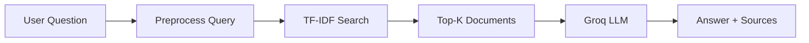

<p align="center">
  <strong>RAG Document Assistant</strong><br>
  Ask questions over your documents — retrieve with TF-IDF, answer with Groq LLM.
</p>

<p align="center">
  
  
  
  
</p>

---

## About

**RAG Document Assistant** is a portfolio project that implements a full **Retrieval-Augmented Generation** pipeline in Python.

You upload plain-text knowledge files, ask a question in natural language, and the system:

1. **Retrieves** the most relevant documents using TF-IDF and cosine similarity
2. **Generates** a grounded answer using the Groq LLM API
3. **Cites** the source files with similarity scores

Built to demonstrate skills in **Python**, **NLP retrieval**, **RAG architecture**, **REST APIs**, and **frontend integration**.

<!-- Add a screenshot after taking one: save as docs/demo.png and uncomment the line below -->
<!--  -->

---

## How it works



| Stage | Technology | What happens |
|-------|------------|--------------|
| **Ingest** | `document_loader.py` | Load `.txt` files from `documents/` |
| **Preprocess** | `preprocessing.py` | Lowercase, remove punctuation, tokenize |
| **Retrieve** | `search_engine.py` | TF-IDF vectors + cosine similarity ranking |
| **Generate** | `rag.py` | Pass excerpts as context → Groq LLM |
| **Serve** | `api.py` + `static/` | REST API + chat UI |

---

## Features

- 🔍 **TF-IDF retrieval** — classic IR with scikit-learn, no GPU required
- 🤖 **RAG pipeline** — LLM answers grounded in retrieved document text
- 💬 **Chat UI** — clean interface with typing indicator and source cards
- 🔌 **REST API** — `/api/ask` for full RAG, `/search` for retrieval only
- 📄 **Source citations** — every answer shows which files were used

---

## Quick Start

**1. Clone and set up the environment**

```bash
cd smart-document-search
python -m venv .venv
source .venv/Scripts/activate   # Git Bash (Windows)
pip install -r requirements.txt
```

**2. Add your Groq API key** (free at [console.groq.com/keys](https://console.groq.com/keys))

```bash
cp .env.example .env
```

```env
LLM_PROVIDER=groq
GROQ_API_KEY=gsk_your-key-here
```

**3. Run**

```bash
uvicorn app.api:app --reload
```

Open **http://127.0.0.1:8000** and try: *"What is RAG and how does it work?"*

---

## Tests

```bash
cd smart-document-search
pip install -r requirements.txt
python -m pytest -v
```

Tests cover document loading, preprocessing, chunk retrieval, and `POST /api/ask` with a mocked LLM (no real API calls).

---

## API

| Method | Endpoint | Description |
|--------|----------|-------------|
| `GET` | `/api/health` | Liveness check — retriever index ready |
| `GET` | `/api/stats` | Document count, chunk count, retrieval method |
| `POST` | `/api/ask` | Full RAG — retrieve chunks + generate answer |
| `GET` | `/search?q=...` | Retrieval only — ranked chunk list |

<details>
<summary><strong>Example: GET /api/health</strong></summary>

```json
{
  "status": "ok",
  "retriever_ready": true
}
```

</details>

<details>
<summary><strong>Example: GET /api/stats</strong></summary>

```json
{
  "document_count": 12,
  "chunk_count": 48,
  "retrieval_method": "Hybrid (Embeddings + TF-IDF)",
  "llm_provider": "Groq"
}
```

</details>

<details>
<summary><strong>Example: POST /api/ask</strong></summary>

**Request**
```json
{
  "query": "What is gradient descent?",
  "top_k": 3
}
```

**Response**
```json
{
  "query": "What is gradient descent?",
  "answer": "Gradient descent is an optimization algorithm...",
  "sources": [
    {
      "document": "machine_learning.txt",
      "chunk_id": "machine_learning.txt:1",
      "similarity_score": 0.9244
    }
  ],
  "provider": "groq"
}
```

</details>

<details>
<summary><strong>Backward compatibility: GET /search</strong></summary>

Response shape is unchanged at the top level: `query` + `top_results`. Each hit still includes `document` and `similarity_score`. Since v2 retrieval, each hit also includes `chunk_id` (additive field). Results are ranked **chunks**, not whole files.

</details>

Interactive docs: **http://127.0.0.1:8000/docs**

---

## Project Structure

```
smart-document-search/
├── app/
│   ├── config.py            # Settings from .env
│   ├── document_loader.py   # Load .txt files
│   ├── preprocessing.py     # Text normalization
│   ├── search_engine.py     # TF-IDF + cosine similarity
│   ├── rag.py               # Retrieval + Groq generation
│   ├── api.py               # FastAPI routes
│   └── main.py              # CLI demo
├── documents/               # Knowledge base (12 sample files)
├── static/                  # Chat UI (HTML, CSS, JS)
├── tests/                   # pytest suite
├── .env.example
└── requirements.txt
```

<details>
<summary><strong>What each file does</strong></summary>

| File | Purpose |
|------|---------|
| `config.py` | Loads paths and Groq credentials from `.env` |
| `document_loader.py` | Reads `.txt` corpus (skips `README.txt`) |
| `preprocessing.py` | Cleans text before indexing |
| `search_engine.py` | Builds TF-IDF matrix, ranks by similarity |
| `rag.py` | Builds LLM context, calls Groq, returns answer + sources |
| `api.py` | HTTP endpoints and static file serving |
| `main.py` | Terminal demo without browser |
| `static/index.html` | Chat page layout |
| `static/style.css` | UI styling |
| `static/app.js` | API calls, message rendering, source cards |

</details>

---

## Tech Stack

| Layer | Tools |
|-------|-------|
| Backend | Python, FastAPI, Uvicorn |
| Retrieval | scikit-learn (TF-IDF, cosine similarity) |
| Generation | Groq LLM (Llama 3.3) |
| Frontend | HTML, CSS, JavaScript |

---

## Notes

- Never commit `.env` — it contains your API key (already in `.gitignore`)
- Files named `README.txt` inside `documents/` are not indexed
- The `openai` Python package is used as a client for the Groq-compatible API

---

## Author

**Wiem Gallaoui** — Python · RAG · Software Engineering

---

<p align="center">
  <sub>Built as a portfolio project to explore retrieval-augmented generation end-to-end.</sub>
</p>
